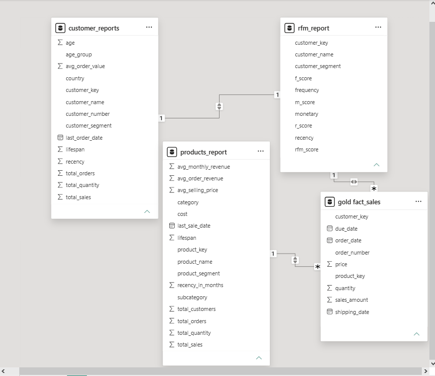

<div align="center">


# 📊 Retail Analytics Data Warehouse & Business Intelligence Dashboard

### End-to-End Business Intelligence Solution using SQL Server & Power BI

[]()
[]()
[]()
[]()
[]()
[]()

</div>

---

# 🌟 Project Overview

This project demonstrates the complete lifecycle of a modern Business Intelligence solution using SQL Server and Power BI.

The project transforms raw CRM and ERP datasets into analytics-ready reporting models through data warehousing, advanced SQL analysis, customer segmentation, and interactive dashboards.

The solution focuses on:

* Sales Performance Analytics
* Customer Analytics
* Product Analytics
* RFM Customer Segmentation
* Executive Reporting
* Business KPI Monitoring

---

# 🏗️ Project Architecture

```text
 Gold Layer
 (Business Ready Data)
        │
        ▼
 SQL Analytics
 (EDA & Advanced Analysis)
        │
        ▼
 Customer Report
 Product Report
 RFM Report
        │
        ▼
 Power BI Dashboard
```

---

# 📂 Repository Structure

```text
Data-Warehouse-Analysis/
│
├── datasets/
│   ├── gold_layer/
|       ├── gold.dim_customers.csv
|       ├── gold.dim_products.csv
|       ├── gold.fact_sales.csv
|
├── scripts/
|   ├── db_init.sql
|   ├── EDA_analysis.sql
|   ├── Advance_Query.sql
|
├── powerbi/
│   └── Retail_Analytics_Dashboard.pbix
│
├── images/
│   ├── data_model.png
│   ├── executive_dashboard.png
│   ├── customer_dashboard.png
│   ├── product_dashboard.png
│   └── rfm_dashboard.png
│
└── README.md
```

---

# 🗄️ Data Model

The analytical model follows a Star Schema design.

### Fact Table

| Table           |
| --------------- |
| gold.fact_sales |

### Reporting Tables

| Table            |
| ---------------- |
| customer_reports |
| products_report  |
| rfm_report       |

---

# 📊 Power BI Data Model



The model is built around the `gold.fact_sales` table and connected to customer, product, and RFM reporting views for business analysis and dashboarding.

---

# 🔍 SQL Analytics

## Exploratory Data Analysis (EDA)

The following analyses were performed:

### Sales Analysis

* Total Revenue
* Total Orders
* Revenue Trend
* Monthly Sales Trend
* Revenue by Category

### Customer Analysis

* Top Customers
* Customer Lifetime Value
* Customer Segmentation
* Customer Activity

### Product Analysis

* Top Products
* Product Revenue
* Product Performance
* Product Lifecycle Analysis

---

# 📈 Advanced Analytics

## Change Over Time Analysis

* Revenue Trends
* Order Trends
* Customer Trends

## Cumulative Analysis

* Running Revenue
* Running Orders
* Moving Averages

## Performance Analysis

* Best Performing Products
* Underperforming Products
* Sales Growth Analysis

## Segmentation Analysis

* Customer Segmentation
* Product Segmentation

## Part-to-Whole Analysis

* Category Contribution
* Revenue Distribution

---

# 🎯 RFM Customer Segmentation

RFM Analysis was implemented to identify customer purchasing behavior.

| Metric    | Description                       |
| --------- | --------------------------------- |
| Recency   | How recently a customer purchased |
| Frequency | How often a customer purchases    |
| Monetary  | How much a customer spends        |

### Customer Segments

* 🏆 Champions
* ⭐ Loyal Customers
* ⚠️ At Risk
* 👥 Regular Customers

This segmentation helps identify high-value customers and potential retention opportunities.

---

# 📊 Dashboard Pages

## Executive Dashboard

Business KPI overview for management.

Features:

* Total Revenue
* Total Orders
* Total Customers
* Average Order Value
* Revenue Trend
* Revenue by Category
* Top Products
* Top Customers

---

## Customer Dashboard

Customer behavior and segmentation analysis.

Features:

* Customer Segments
* Customer Demographics
* Customer Revenue Analysis
* Top Customers
* Customer Activity Metrics

---

## Product Dashboard

Product performance monitoring.

Features:

* Product Segments
* Top Products
* Revenue by Category
* Product Profitability
* Product Lifecycle Metrics

---

## RFM Dashboard

Advanced customer segmentation dashboard.

Features:

* Champions
* Loyal Customers
* At Risk Customers
* Regular Customers
* Customer Segment Distribution

---

# 🛠️ Technologies Used

| Tool       | Purpose                    |
| ---------- | -------------------------- |
| SQL Server | Data Warehouse Development |
| SSMS       | SQL Development            |
| Power BI   | Dashboard Development      |
| GitHub     | Version Control            |
| SQL        | Analytics & Reporting      |

---

# 🧠 SQL Concepts Applied

### Data Warehousing

* Gold Layer
* Star Schema Design

### SQL Analytics

* Joins
* Aggregations
* CTEs
* CASE Statements
* Views
* Window Functions
* Ranking Functions
* RFM Segmentation

---

# 📌 Key Business Insights

* Identified highest revenue-generating products.
* Segmented customers using RFM methodology.
* Analyzed product lifecycle performance.
* Measured customer purchasing behavior.
* Created executive-level KPI reporting.
* Built interactive analytical dashboards for business decision-making.

---

# 🚀 Future Enhancements

* Customer Churn Prediction
* Product Recommendation System
* Demand Forecasting
* Automated ETL Pipelines
* Incremental Data Loading
* Real-Time Reporting

---

# 👨‍💻 Author

**Jarin Akther**

Data Analytics | Business Intelligence | SQL | Power BI

GitHub: https://github.com/YOUR_USERNAME

---

<div align="center">

⭐ If you found this project useful, consider giving it a star!

</div>
